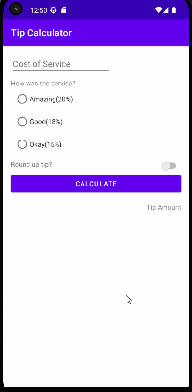

# Tip-Calculator-App

Code for Android Basics Codelab.

Introduction
------------
The Tip Calculator app allows users to enter the amount of their bill and calculates the tip based on different service categories such as "Amazing," "Good," and "Okay." It also includes a feature to round up the tip amount. The calculated tip amount,the tip is displayed below the calculate button.

Pre-requisites
--------------

You need to know:
- How to open, build, and run apps with Android Studio.
- What an activity is, and how to create one in your app.
- What the activity's onCreate() method does, and the kind of operations
  that are performed in that method.

Getting Started
---------------

1. Download and run the app.

Demo of App
---------------

## Author

- [Raban Kathariya](https://www.github.com/raban2)
